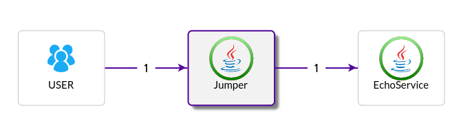
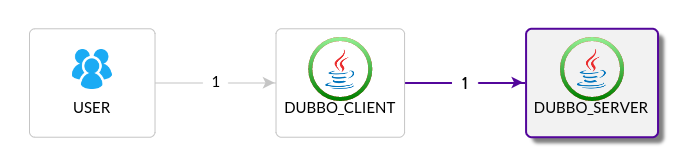

# pinpoint demo apps
Provide some demo app for test pinpoint.

# common usage
Place the source code of pinpoint and this project under same directory.
In each demo app dir:

**make copy** will copy the agent files from pinpoint agent dir after build pinpoint successfully. The pinpoint version will be extract from pinpoint quickstart config automatically.

**make run** will run app without agent.

**make runa** will run app with agent.

**make curl** will access the web url for demo web app

**make debuglog** set pinpoint agent log level to DEBUG

**make logplugin** write transactionId and spanId in app's log, set sampling rate to 50%

# tested demo app groups
**only tested under ubuntu, with 1.6.0-RC1 and 1.6.1-SNAPSHOT**

## jumper and echo
jumper calls echo in 4 ways, using HttpClient, JDKHttp API, Hystrix, And Thrift.

Under jumper and echo directory. Tested.

Under echo, using **make jettya** to start echo app using jetty server

### start a transaction

**make ggs** start a transaction using google client sync call

**make gga** start a transaction using google client async call

**make hc3** start a transaction using http client 3 sync call

**make hc3s** start a transaction using http client 4 sync call

**make hc3a** start a transaction using http client 4 async call

**make jdk** start a transaction using jdk httpConection

**make ning** start a transaction using ning client call

**make oks** start a transaction using ok http client sync call

**make oka** start a transaction using ok http client async call

## dubbo client and server

Under dubbo-echo-client and dubbo-echo-server directory. Tested. Using multicast registry.

Run **make curl** under dubbo-echo-client to start a transaction.

## spring kafka producer, consumer and echo

Under spring-kafka-producer and spring-kafka-consumer directory. Tested. You should start a kafka server on localhost.

Run **make curl** under spring-kafka-producer to start a transaction.

## echo to test user plugin
make curl2

## activemq
Run rabbitmq server on localhost, then run below app. Detail refer to Makefile in each app dir.

rabbitmq-producer is a web app, access it to send a message to rabbitmq server.
rabbitmq-consumer is java standalone app, receive messages from rabbitmq server.

**make curl** under rabbitmq-producer to start a transaction

## pinpointutils `TODO`
some util formater to be used under hbase shell for pinpoint. Not include now.

# nodejs helloworld
TODO
see myexpress, using nodejs agent from peaksnail

