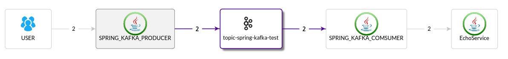

[中文](README_zh.md)

# pinpoint demo apps
Demo apps for test pinpoint. Also for skywalking and zipkin.

Only tested under linux. Cygwin needed for make under windows.

# directory layout

each sub-directory is an app based on java or nodejs.

# common usage

Please run "mvn clean install" before run each app.

There is a Makefile for common usage under each app's dir.
## common.gmk

PINPOINT_BASE should point to pinpoint source code which is using to detect pinpoint version and copy agent directory to each app.

Also some common chages for pinpoint.config

## for each app

**make copy** will copy the agent files from PINPOINT_BASE.

**make run** will run app without agent.

**make runa** will run app with agent.

**make curl** will access common url provided by demo web app to start a transaction.

**make debuglog** set pinpoint agent log level from INFO to DEBUG

**make logplugin** write transactionId and spanId in app's log, set sampling rate to 50%.

# tested demo app groups
Most app runs with another app, one provides service and another access it to make a call chain.

## jumper and echo
jumper calls echo using several client library, such as HttpClient, JDKHttp API, Hystrix, And Thrift etc.

Default using tomcat server, **make jettya** to use jetty.

### start a transaction using different library

**make ggs** start a transaction using google client sync call

**make gga** start a transaction using google client async call

**make hc3** start a transaction using http client 3 sync call

**make hc4s** start a transaction using http client 4 sync call

**make hc4a** start a transaction using http client 4 async call

**make jdk** start a transaction using jdk httpConection

**make ning** start a transaction using ning client call

**make oks** start a transaction using ok http client sync call

**make oka** start a transaction using ok http client async call

### echo make target

**make curl** echo back service

**make attack** simulate shell injection attack

## dubbo client and server

dubbo-echo-client and dubbo-echo-server, using multicast as registry.

dubbo-echo-client uses round-robin policy, copy dubbo-echo-server and un-commnet SLEEPLONG to simulate timeout.

## spring kafka producer, consumer and echo

spring-kafka-producer and spring-kafka-consumer. You should start a 0.10.x kafka server on localhost.

## echo to test user plugin
make curl2

## rabbitmq
rabbitmq-producer and rabbitmq-consumer. You should run a rabbitmq server on localhost without user/password to login.

## pinpointutils `TODO`
some util formater to be used under hbase shell for pinpoint. Not include now.

# nodejs helloworld
TODO

# php
TODO

