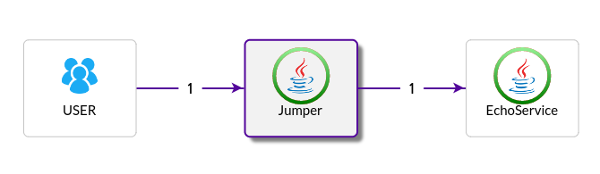
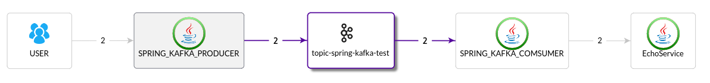

[中文](README_ZH.md)

# pinpoint demo apps

测试APM(应用性能管理)软件pinpoint的应用集合.部分应用也可用于测试skywalking/zipkin.

仅在Linux下测试.Windows下可使用cygwin环境(需要使用make命令).

# 项目结构

每个子目录是一个独立的app,基于Java或nodejs.

# 通用操作

在运行各app前请在根目录下执行一次mvn clean install.

在每个app的目录下,都通过相应的Makefile完成通用的操作.

## 根目录下的common.gmk

PINPOINT_BASE 变量是pinpoint源码的目录,用于判断pinpoint的版本号和复制编译好的agent目录.

提供了通用的复制agent目录,和修改相应配置的一些make目标.

## 每个app目录下可执行

**make copy** 自动从PINPOINT_BASE检测版本号并复制agent目录到当前目录下

**make run** 不带agent启动应用

**make runa** 带agent启动应用

**make curl** 访问当前应用,启动一次transaction. 可能有多种transaction可启动,具体可查看Makefile内容

**make debuglog** 修改agent的log级别为DEBUG,默认为INFO.

**make logplugin** 修改采样率为50%,并在应用的log中记录txId/spanId

# 常用应用组合

大部分应用需要2个同时运行,以测试分布情况下的调用链跟踪.

## jumper and echo
jumper应用会调用echo应用, 分别使用HttpClient3/4, JDKHttp API, Hystrix, And Thrift等等.

jumper和echo默认用tomcat启动, **make jettya**则使用jetty启动

### jumper的make目标和对应的库

**make ggs** 使用google client的同步调用

**make gga** 使用google client的异步调用

**make hc3** 使用http client 3的同步调用

**make hc4s** 使用http client 4的同步调用

**make hc4a** 使用http client 4的异步调用

**make jdk** 使用jdk自带的HttpConection

**make ning** 使用ning client

**make oks** 使用ok http client的同步调用

**make oka** 使用ok http client的异步调用

### echo的make目录

**make curl** 基本的servlet

**make attack** 模拟注入攻击

## dubbo client and server

dubbo-echo-client和dubbo-echo-server,使用multicast作为registry.可修改dubbo配置文件使用zookeeper.

client端默认使用轮询策略,可复制一份server,修改配置中的端口信息,取消Makefile中的对SLEEPLONG的注释,模拟总是服务超时的情景.

## spring kafka producer, consumer and echo

spring-kafka-producer和spring-kafka-consumer和echo, 仅用于kafka 0.10版本.需要本机启动一个kafka server.

## echo to test user plugin
make curl2

## rabbitmq
rabbitmq-producer和rabbitmq-consumer, 需要本机运行rabbitmq server(本机运行,且无需帐号密码即可登录)

## pinpointutils `TODO`
小工具,转换txId的二进制格式.

# nodejs helloworld
TODO 未测试.
agent克隆自peaksnail.

# php
TODO
